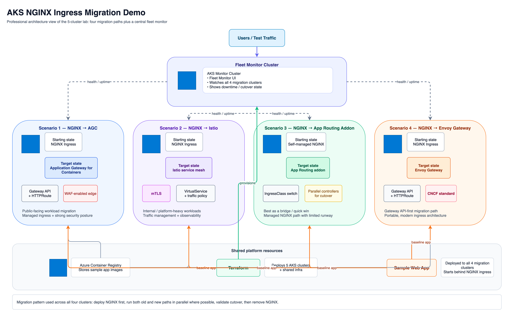

# AKS NGINX Ingress Migration Demo

Multi-scenario demo environment for migrating from the deprecated NGINX Ingress Controller to modern alternatives on AKS. Based on [NGINX Discontinuation in AKS — Enterprise Migration Guide](https://github.com/nthewara/nginx-migration-demo).



## 🎯 Why This Demo Exists

The Kubernetes NGINX Ingress Controller reached **end of maintenance in March 2026**. Microsoft's managed Application Routing addon (NGINX-based) ends support in **November 2026**. Every AKS customer running NGINX needs a migration plan.

This demo provides **4 AKS clusters, each running NGINX**, and walks through migrating each one to a different replacement — showing the real-world process, trade-offs, and zero-downtime migration techniques.

## 🏗️ Architecture

```
┌──────────────────────────────────────────────────────────────────────────┐
│                        Fleet Monitor (5th cluster)                       │
│                     Watches all 4 migration clusters                     │
│                    Shows uptime during each migration                    │
└───────────────┬──────────────┬──────────────┬──────────────┬────────────┘
                │              │              │              │
    ┌───────────▼───┐  ┌──────▼──────┐  ┌────▼────────┐  ┌─▼───────────┐
    │  Cluster 1     │  │  Cluster 2   │  │  Cluster 3   │  │  Cluster 4  │
    │  NGINX → AGC   │  │  NGINX →     │  │  NGINX →     │  │  NGINX →    │
    │                │  │  Istio       │  │  App Routing  │  │  Envoy GW   │
    │                │  │  Service     │  │  Addon        │  │  (Gateway   │
    │  Gateway API   │  │  Mesh        │  │  (Bridge)     │  │   API)      │
    │  + WAF         │  │  + mTLS      │  │  + Quick Win  │  │  + CNCF     │
    └────────────────┘  └─────────────┘  └──────────────┘  └─────────────┘
```

## 📋 Migration Scenarios

### Scenario 1: NGINX → Application Gateway for Containers (AGC)
**Best for:** Public-facing workloads needing WAF, managed infrastructure
- Deploy NGINX ingress with sample app
- Install ALB Controller + provision AGC
- Create Gateway + HTTPRoute alongside existing Ingress
- Shift traffic from NGINX to AGC
- Validate WAF protection
- Remove NGINX

### Scenario 2: NGINX → Istio Service Mesh
**Best for:** Internal workloads needing mTLS, traffic management, observability
- Deploy NGINX ingress with sample app
- Enable Istio addon with internal ingress gateway
- Create Istio VirtualService routing
- Enable mTLS across services
- Shift traffic from NGINX to Istio gateway
- Remove NGINX

### Scenario 3: NGINX → App Routing Addon (Managed Bridge)
**Best for:** Quick migration, buy time until November 2026
- Deploy self-managed NGINX with sample app
- Enable App Routing addon
- Change IngressClass to `webapprouting.kubernetes.azure.com`
- Run both controllers in parallel
- Validate and cut over
- Remove self-managed NGINX

### Scenario 4: NGINX → Envoy Gateway (Gateway API)
**Best for:** Gateway API-first, cloud-agnostic, CNCF standard
- Deploy NGINX ingress with sample app
- Install Envoy Gateway
- Create Gateway + HTTPRoute resources
- Run dual-stack (Ingress + HTTPRoute) during migration
- Shift traffic to Envoy Gateway
- Remove NGINX

## 📁 Repository Structure

```
nginx-migration-demo/
├── README.md
├── terraform/                    # Infrastructure (5 AKS clusters)
│   ├── main.tf
│   ├── clusters.tf
│   ├── providers.tf
│   ├── variables.tf
│   └── terraform.tfvars.example
├── app/                          # Sample web app (deployed to all clusters)
│   ├── Dockerfile
│   ├── app.py
│   └── k8s/
│       ├── namespace.yaml
│       ├── deployment.yaml
│       ├── service.yaml
│       └── nginx-ingress.yaml    # Starting state: NGINX ingress
├── scenarios/
│   ├── 01-agc/                   # AGC migration manifests + guide
│   ├── 02-istio/                 # Istio migration manifests + guide
│   ├── 03-app-routing/           # App Routing addon migration guide
│   └── 04-envoy-gateway/        # Envoy Gateway manifests + guide
├── docs/
│   ├── architecture.png
│   └── migration-checklist.md
└── monitor/                      # Fleet Monitor config for this lab
```

## 🔧 Infrastructure

| Resource | Spec | Purpose |
|----------|------|---------|
| **Cluster 1** (AGC) | 2 nodes, D4s_v3 | NGINX → AGC migration |
| **Cluster 2** (Istio) | 2 nodes, D4s_v3 | NGINX → Istio migration |
| **Cluster 3** (App Routing) | 2 nodes, D4s_v3 | NGINX → App Routing addon |
| **Cluster 4** (Envoy GW) | 2 nodes, D4s_v3 | NGINX → Envoy Gateway |
| **Cluster 5** (Monitor) | 1 node, D2s_v3 | Fleet Monitor dashboard |
| **ACR** | Basic | Container images |
| **Estimated cost** | ~$20/day | All 5 clusters |

## 🚀 Quick Start

```bash
# 1. Deploy infrastructure
cd terraform
terraform init -backend-config=~/tfvars/backend.hcl
terraform plan -var-file=~/tfvars/nginx-migration.tfvars -out=tfplan
terraform apply tfplan

# 2. Build sample app
az acr build --registry <acr> --image migration-app:v1 app/

# 3. Deploy NGINX + app to all 4 clusters
# (Each cluster starts with identical NGINX ingress setup)

# 4. Follow scenario guides in scenarios/
```

## 📊 Demo Flow

### Setup (~15 min)
1. Deploy 5 AKS clusters via Terraform
2. Install NGINX ingress controller on clusters 1-4
3. Deploy sample app with NGINX ingress on all 4
4. Deploy Fleet Monitor on cluster 5, watching all 4 apps
5. Confirm all green on Fleet Monitor

### Migrations (~15 min each)
Run each scenario in parallel or sequentially:
1. **Cluster 1:** Migrate to AGC (Gateway API + WAF)
2. **Cluster 2:** Migrate to Istio (service mesh + mTLS)
3. **Cluster 3:** Migrate to App Routing addon (quick bridge)
4. **Cluster 4:** Migrate to Envoy Gateway (CNCF Gateway API)

### Comparison (~5 min)
- Show Fleet Monitor: which migrations caused downtime vs zero-downtime
- Compare the migration complexity of each approach
- Discuss trade-offs: managed vs self-managed, Gateway API vs vendor-specific

## 📚 References

- [NGINX Discontinuation in AKS — Enterprise Migration Guide](https://github.com/nthewara/nginx-migration-demo)
- [Gateway API Documentation](https://gateway-api.sigs.k8s.io/)
- [Azure AGC Documentation](https://learn.microsoft.com/en-us/azure/application-gateway/for-containers/overview)
- [AKS Istio Addon](https://learn.microsoft.com/en-us/azure/aks/istio-about)
- [App Routing Addon](https://learn.microsoft.com/en-us/azure/aks/app-routing)
- [Envoy Gateway](https://gateway.envoyproxy.io/)
